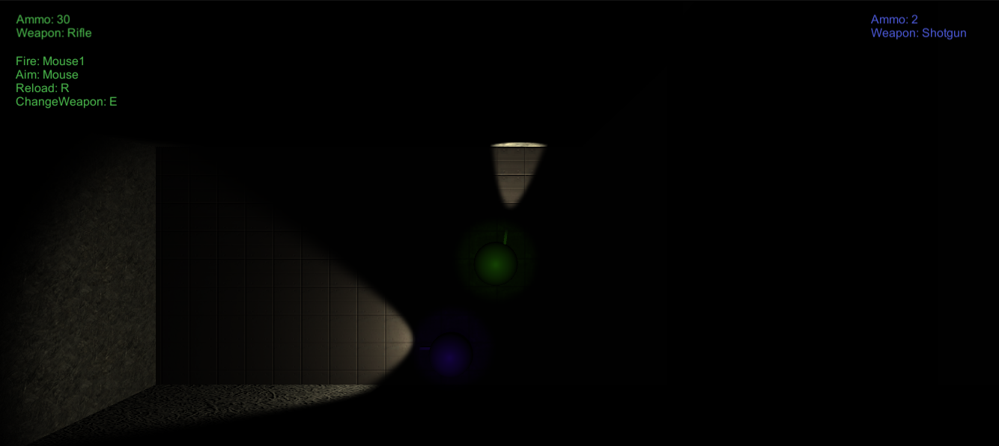
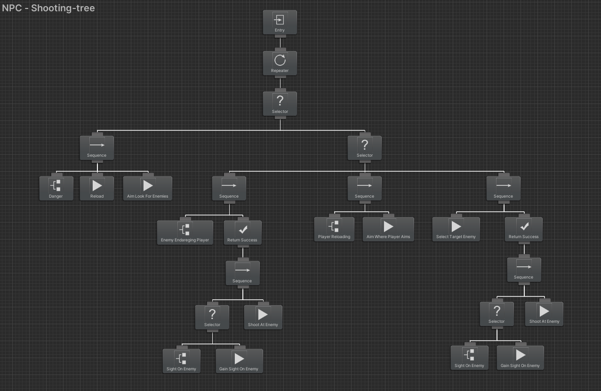
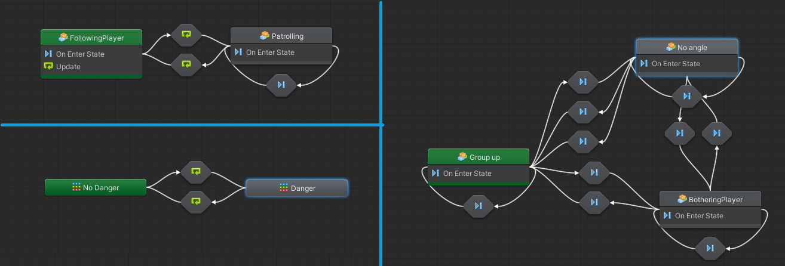
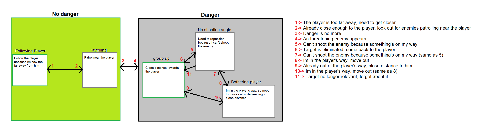
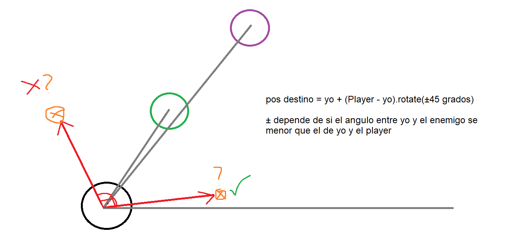

# IA Proyecto 
_Javier Cruz López De Ochoa_
____________________________________________________________________________________________________________________________
## _NPC Acompañante_
> El proyecto se basa en un npc que acompaña al jugador a donde vaya, otorgándole apoyo y visión extra. El objetivo del juego es eliminar los 5 generadores de enemigos que hay en el nivel. 
>
> 

El jugador se mueve con las teclas W, A, S, D, dispara y apunta con el ratón, recarga con la R y cambia de arma con la E. 

__________

- _ARBOL DE COMPORTAMIENTO PARA APUNTAR_
  De arriba a abajo es el orden de prioridad del árbol
  
  - Si NO está en peligro:
    - Aprovecha para recargar y mira alrededor en busca de enemigos
  - Si SÍ está en peligro: 
    - Mira a ver si hay algún enemigo cerca del jugador para apuntar a ese y eliminarlo
    - Mira a ver si el jugador está recargando, para iluminar donde apunte el jugador
    - Selecciona un enemigo e intenta eliminarlo

 
 
_________

- _MÁQUINA DE ESTADO PARA EL MOVIMIENTO_
  
  - Not in Danger:
    - Follow player --> si el npc está demasiado lejor del jugador, va hacia el jugador
    - Patrol  -->  si el npc está cerca del jugador, patrulla la zona

  - In Danger: 
    - Group up  --> se acerca mucho al jugador
    - No angle  --> el npc no puede disparar al enemigo que tiene como Target, por lo que se reposiciona para ganar vision
    - Bothering player  --> si el npc está en la línea de fuego del jugador, intenta apartarse

   Existen auto-aristas para calcular cada x tiempo en vez de en cada tick
  
   
   
   
   >Explicacion del movimiento No Angle (Negro:NPC, Verde:Player, Morado:Enemigo)
   >
   >
    _________

 
